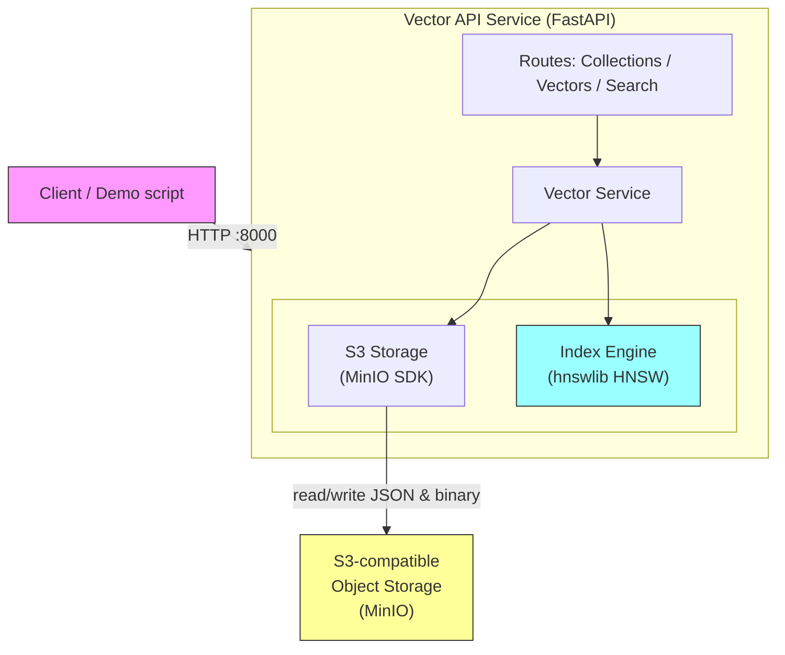
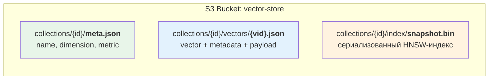
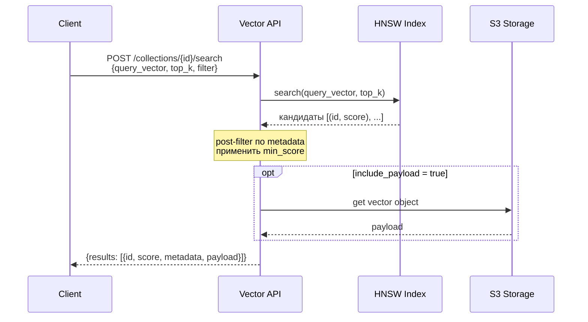
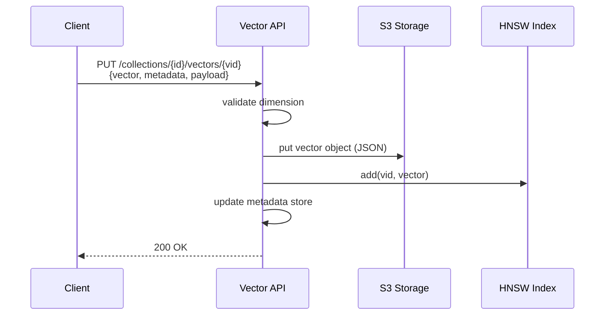
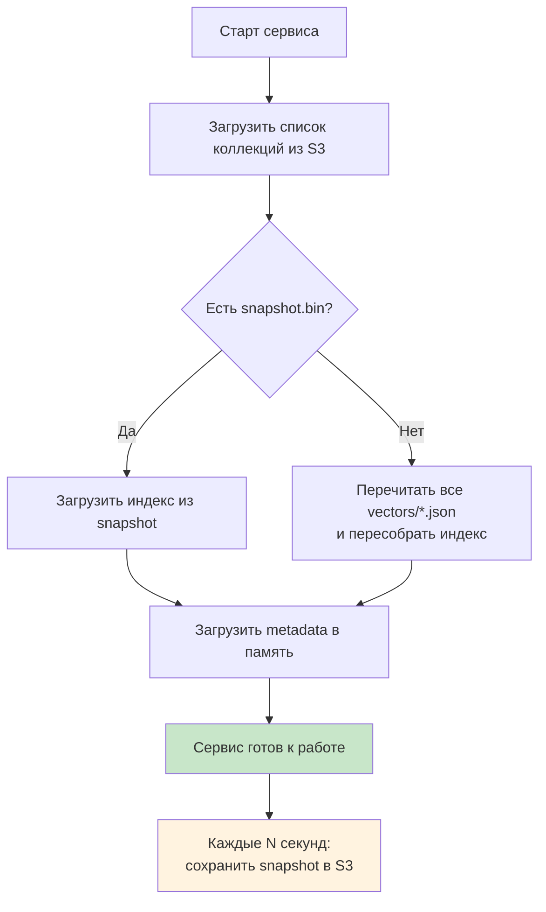

# S3 Vector Store PoC

Vector Store поверх S3-compatible Object Storage.
Отдельный compute-сервис, который принимает готовые эмбеддинги, хранит их в S3,
строит ANN-индекс и выполняет similarity search.

## Зачем

Проверить гипотезу: можно ли собрать vector search **поверх существующего S3**,
не трогая ядро object storage, а вынеся весь compute в отдельный сервис.

Ответ: **да, можно.** S3 работает как durable storage для векторов, метаданных
и snapshot-ов индекса. Векторный поиск живёт в отдельном процессе с in-memory
HNSW-индексом.

## Архитектура



### Что хранится в S3



Индекс — **в памяти процесса**. Периодически (каждые N секунд) сохраняется
в S3 как snapshot. При рестарте загружается из snapshot, а если его нет —
перестраивается из всех vector-объектов в S3.

## Как работает поиск



1. ANN-индекс (HNSW) находит ~top_k ближайших кандидатов — **не перебирает все векторы**
2. Если задан `filter` — post-filter по metadata (exact match)
3. Если задан `min_score` — отсекает кандидатов ниже порога
4. Индекс **один на коллекцию**, обновляется при каждой вставке

## Как работает запись



S3 — source of truth, индекс — производная структура для быстрого поиска.

## Как работает восстановление



## API

### Collections

| Метод | Путь | Описание |
|-------|------|----------|
| `POST` | `/collections` | Создать коллекцию (name, dimension, distance_metric) |
| `GET` | `/collections` | Список коллекций |
| `GET` | `/collections/{id}` | Информация о коллекции |
| `DELETE` | `/collections/{id}` | Удалить коллекцию со всеми данными |

### Vectors

| Метод | Путь | Описание |
|-------|------|----------|
| `PUT` | `/collections/{id}/vectors/{vid}` | Добавить/обновить вектор |
| `GET` | `/collections/{id}/vectors/{vid}` | Получить вектор по id |
| `DELETE` | `/collections/{id}/vectors/{vid}` | Удалить вектор |
| `POST` | `/collections/{id}/vectors:batchPut` | Батчевая вставка (до 1000) |

### Search

| Метод | Путь | Описание |
|-------|------|----------|
| `POST` | `/collections/{id}/search` | Similarity search |

**Параметры поиска:**
```json
{
  "query_vector": [0.1, 0.2, ...],
  "top_k": 5,
  "min_score": 0.7,
  "filter": {"space": "ENG"},
  "include_metadata": true,
  "include_payload": true
}
```

### Служебные

| Метод | Путь | Описание |
|-------|------|----------|
| `GET` | `/health` | Health check |
| `GET` | `/stats` | Количество коллекций и векторов |

## Стек

| Компонент | Технология |
|-----------|-----------|
| API | Python 3.11, FastAPI |
| ANN-индекс | hnswlib (HNSW) |
| Object Storage | MinIO (S3-compatible) |
| Модели | Pydantic v2 |
| Логирование | structlog |
| Контейнеризация | Docker Compose |

## Быстрый старт

```bash
# Поднять MinIO + API
docker compose up -d

# Проверить
curl http://localhost:8000/health

# Запустить демо (создаст коллекцию, загрузит векторы, выполнит поиск)
pip install httpx numpy
python -m demo.demo
```

## Конфигурация

Все параметры через переменные окружения с префиксом `S3V_`:

| Переменная | По умолчанию | Описание |
|-----------|-------------|----------|
| `S3V_S3_ENDPOINT` | `localhost:9000` | Адрес S3 |
| `S3V_S3_ACCESS_KEY` | `minioadmin` | Access key |
| `S3V_S3_SECRET_KEY` | `minioadmin` | Secret key |
| `S3V_S3_BUCKET` | `vector-store` | Имя бакета |
| `S3V_S3_USE_SSL` | `false` | SSL |
| `S3V_SNAPSHOT_INTERVAL_SECONDS` | `60` | Интервал сохранения snapshot |
| `S3V_LOG_LEVEL` | `INFO` | Уровень логирования |

## Тесты

```bash
# Установить зависимости
pip install -e ".[dev]"

# Запустить (51 тест, ~0.5 сек)
pytest tests/ -v
```

## Ограничения PoC

- Один compute-инстанс, индекс в памяти
- Нет шардирования, репликации, HA
- Metadata filter — только exact match (post-filter)
- Нет IAM, multi-tenancy, billing
- Snapshot раз в N секунд, не real-time
- Это демонстрация концепта, не production-система

## Структура проекта

```
s3-vector/
├── src/
│   ├── main.py                 # FastAPI app, lifespan, health/stats
│   ├── config.py               # Настройки из env
│   ├── models.py               # Pydantic-модели
│   ├── s3_storage.py           # S3 CRUD (MinIO SDK)
│   ├── index_engine.py         # hnswlib wrapper
│   ├── collection_manager.py   # Lifecycle коллекций + snapshot
│   ├── vector_service.py       # CRUD + search orchestration
│   └── routes/
│       ├── collections.py      # Collection endpoints
│       ├── vectors.py          # Vector endpoints
│       └── search.py           # Search endpoint
├── tests/                      # 51 тест (unit + integration)
├── demo/
│   ├── demo.py                 # E2E демо-сценарий
│   └── sample_data.py          # Синтетические embeddings
├── Dockerfile
└── docker-compose.yml          # MinIO + vector-api
```
